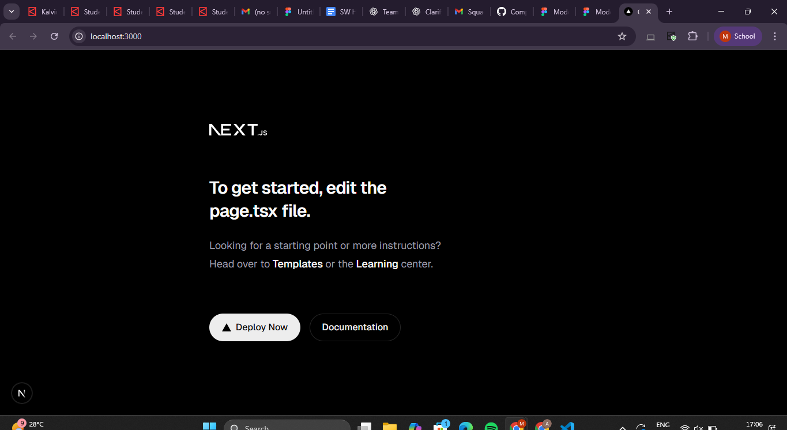
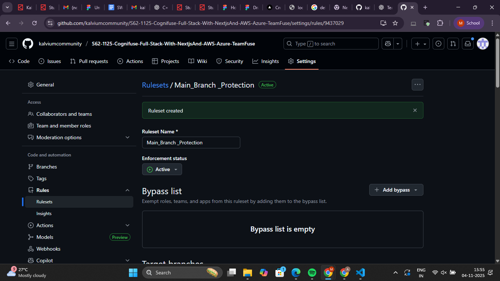
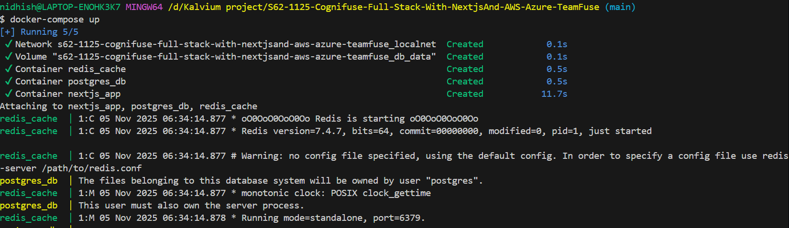
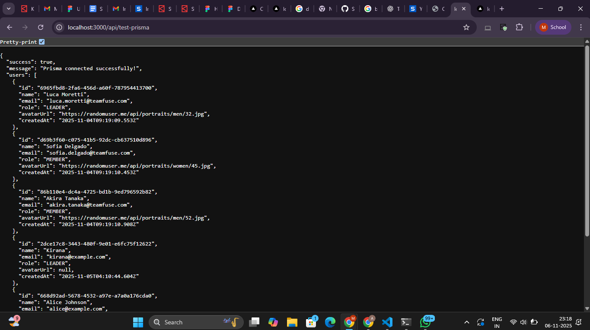

## Project Title & Problem Statement

**TeamFuse** is a productivity and collaboration platform that helps student and developer teams track progress, manage tasks, and visualize contributions effectively.  
It addresses the problem of **limited visibility into individual engagement**, **communication gaps**, and **unbalanced workloads** within group projects.

The platform enables:

- Real-time project updates and activity tracking
- Task assignment with performance scoring
- GitHub and Google Docs integration
- Visual dashboards for contribution analytics

By combining these, TeamFuse ensures **transparent, data-driven teamwork** and improved project outcomes.

---

## Folder Structure & Explanation

```bash
src/
├── app/          # Application routes and pages using Next.js App Router
├── components/   # Reusable UI elements like buttons, cards, and modals
├── lib/          # Utility functions, configurations, and helper logic
├── styles/       # Global styles and Tailwind configuration
├── public/       # Static assets (images, icons, and logos)
```

### Description:

- **app/** → Defines routes and page layouts for better navigation.
- **components/** → Promotes reusability and clean, consistent UI design.
- **lib/** → Contains shared logic, configurations, and API helpers.
- **styles/** → Stores Tailwind and global styling files for theme control.
- **public/** → Holds static assets accessible throughout the app.

This modular structure helps maintain **clarity**, **scalability**, and **team collaboration** throughout the development cycle.

---

## Setup Instructions

Follow these steps to set up and run the project locally:

### 1. Clone the Repository

```bash
git clone https://github.com/kalviumcommunity/S62-1125-Cognifuse-Full-Stack-With-NextjsAnd-AWS-Azure-TeamFuse.git

cd teamfuse
```

### 2️. Install Dependencies

```bash
npm install
```

### 3️. Run the Development Server

```bash
npm run dev
```

Now opening browser and going to **[http://localhost:3000](http://localhost:3000)** — app runs successfully.

---

## Reflection

This project structure ensures **clear separation of concerns**, making it easier for each team member to work on different parts without conflicts.

- The **app/** directory organizes routes efficiently using the Next.js App Router.
- The **components/** folder promotes reusability and reduces UI redundancy.
- The **lib/** folder centralizes configurations and helper functions for maintainability.

This layout will allow TeamFuse to **scale easily** in future sprints — enabling faster feature additions, smoother backend integration, and efficient deployment to AWS/Azure.

---

## LLD

https://www.figma.com/design/1XKXXtjbzosqgQ1hcjJQc9/Untitled?node-id=0-1&t=lii0cBLhZmT1hDsQ-1

https://www.figma.com/proto/1XKXXtjbzosqgQ1hcjJQc9/Untitled?page-id=0%3A1&node-id=5-19&p=f&viewport=-540%2C-278%2C0.25&t=5sXF9xDsJaCC7K76-1&scaling=min-zoom&content-scaling=fixed

## Screenshot of Local App Running



---

## TypeScript & ESLint Configuration

### Strict TypeScript

Enabled strict mode in tsconfig.json to catch type errors early and prevent unused code.

## Code Review Checklist

Before submitting your Pull Request (PR), make sure you’ve verified the following:

- [ ] Code runs without errors locally
- [ ] Follows the established folder structure and naming conventions
- [ ] No unused files, variables, or console logs
- [ ] Comments added where logic might not be immediately clear
- [ ] UI matches design or mockup closely
- [ ] README and PR description updated with latest info
- [ ] Screenshots added (if UI feature)
- [ ] Reflections or notes included for team discussion

This checklist ensures that all contributions maintain consistency, readability, and quality across the TeamFuse project.

## Branching Strategy & Naming Conventions

To maintain a clean and professional Git workflow, TeamFuse follows a consistent branching strategy.  
Each branch name clearly indicates its purpose, making collaboration and reviews easier.

### 🔹 Branch Naming Format

- feature/admin-ruleset-management, feature/user-dashboard, feature/login-auth → For developing new modules or adding new functionalities to the Cognifuse project.

- fix/ruleset-display-error, fix/api-authentication-failure → For resolving bugs, UI issues, or fixing existing code errors.

- chore/env-setup, chore/dependency-update, chore/build-optimization → For configuration updates, refactoring, or maintenance-related improvements.

- docs/pr-guidelines, docs/readme-update, docs/setup-instructions → For updating documentation, guides, or workflow-related information.

### PR Template

Stored in `.github/pull_request_template.md`

### Code Review Checklist

(Include the checklist added above)

### Reflection

This branching structure helps our team:

- Keep commits organized by purpose
- Simplify code reviews and pull requests
- Prevent conflicts and direct changes to the main branch
- Scale easily as our codebase and team grow

Following this structure ensures consistency, traceability, and cleaner collaboration across all future sprints.

### Screenshots

- Screenshot of branch protection
  

- Screenshot of a PR showing checks/review approval
  
✔ Running tasks for staged files...
✔ Applying modifications from tasks...
✔ Cleaning up temporary files...
[EsLint 502bd23] Checking EsLint Setup
 1 file changed, 1 insertion(+)
```


# Environment Variables Configuration for TeamFuse

This document explains the environment variables needed for the **TeamFuse project**, their purposes, client vs server safety, how to replicate the setup using `.env.example`, and common pitfalls avoided.

---

## Purpose of Each Environment Variable

| Variable | Purpose | Client-Side Safe? |
|-----------|----------|------------------|
| `DATABASE_URL` | MongoDB connection string used to connect the TeamFuse backend to the database | No (Server-side only) |
| `JWT_SECRET` | Secret key for signing and verifying JSON Web Tokens during authentication | No (Server-side only) |
| `NEXTAUTH_SECRET` | Secret used for encrypting and securing NextAuth sessions | No (Server-side only) |
| `REDIS_URL` | Redis cache connection URL for improving performance and managing session storage | No (Server-side only) |
| `NODE_ENV` | Defines whether the app is running in development or production mode | No (Server-side only) |
| `UPI_SERVICE_URL` | API endpoint for handling UPI payment or verification services | No (Server-side only) |
| `NEXTAUTH_URL` | Public URL of the TeamFuse application used for authentication callbacks | Yes (safe to expose if needed) |
| `NEXT_PUBLIC_API_BASE_URL` | Base URL used by the frontend to make API requests to the backend | Yes (safe to expose if needed) |

---

## Server-Side vs Client-Side Access

- All environment variables except `NEXTAUTH_URL` and `NEXT_PUBLIC_API_BASE_URL` are **server-side only** and must not be exposed in client-side bundles.  
- Ensure no sensitive variables have the `NEXT_PUBLIC_` prefix, as Next.js exposes those to the browser.  
- Variables without the `NEXT_PUBLIC_` prefix are accessible only in API routes and server code via `process.env`.  
- This separation protects secrets like database URLs, JWT secrets, and Redis connections from being exposed to users.

---

## How to Replicate the Setup Using `.env.example`

1. Copy `.env.example` to `.env.local` in your project root.  
2. Replace placeholder values with your actual credentials and secrets:  
   - Update `DATABASE_URL` with your MongoDB connection string  
   - Generate strong secrets for `JWT_SECRET` and `NEXTAUTH_SECRET`  
   - Configure correct Redis connection URL (`REDIS_URL`)  
   - Point `UPI_SERVICE_URL` to your actual service endpoint  
   - Set `NEXTAUTH_URL` and `NEXT_PUBLIC_API_BASE_URL` according to your deployment environment  
3. Add `.env.local` to your `.gitignore` file to prevent committing sensitive secrets to version control.  
4. Restart your development or production server after modifying `.env.local` to ensure all variables load correctly.  
5. For deployment, use your cloud provider’s environment variable configuration instead of local `.env` files.

---

## Common Pitfalls Avoided

- **Exposing secrets accidentally**: No sensitive variables are prefixed with `NEXT_PUBLIC_`, avoiding client bundle exposure.  
- **Accidental commits**: The `.env.local` file is excluded from version control while `.env.example` acts as a safe reference.  
- **Runtime vs build-time issues**: Variables are accessed safely at runtime, preventing leakage during build.  
- **Clear structure**: All variables follow consistent naming, making configuration simple for future developers.  
- **Misconfiguration prevention**: Each variable’s role and exposure level are clearly documented.

---

This approach ensures secure and efficient environment management for **TeamFuse**, enabling safe scaling and easy onboarding for all contributors.

---
=======
# 🐳 Docker Setup — Next.js + Prisma + PostgreSQL + Redis

## 📌 Overview

This project uses Docker to containerize:

- **Next.js app** (with Prisma ORM)
- **PostgreSQL database**
- **Redis** (for caching)

All services run together using `docker-compose`.

---

## 📂 Dockerfile (What It Does)

| Step                                 | Purpose                                       |
| ------------------------------------ | --------------------------------------------- |
| `COPY package*.json` + `npm install` | Installs dependencies                         |
| `COPY prisma ./prisma`               | Copies Prisma schema **before build**         |
| `RUN npx prisma generate`            | Generates Prisma Client with _Linux binaries_ |
| `COPY . .`                           | Adds remaining project files                  |
| `RUN npm run build`                  | Builds Next.js app for production             |
| `CMD ["npm", "run", "start"]`        | Starts the app in production mode             |

🔑 **Important:** Prisma must be generated _before copying the full project_, or Windows binaries overwrite Linux binaries.

---

## 🧩 docker-compose.yml (Services Explained)

| Service | Image / Build        | Description                                         |
| ------- | -------------------- | --------------------------------------------------- |
| `app`   | Builds Dockerfile    | Runs Next.js (uses Prisma + connects to DB + Redis) |
| `db`    | `postgres:15-alpine` | Stores application data                             |
| `redis` | `redis:7-alpine`     | Used as cache layer                                 |

### Networking / Volumes

| Item       | Usage                                                           |
| ---------- | --------------------------------------------------------------- |
| `localnet` | A shared Docker network allowing services to talk to each other |
| `db_data`  | Persistent volume for PostgreSQL data                           |

---

## 🛠 Running the Project

```sh
docker-compose build --no-cache
docker-compose up
```

## Screenshot of Docker Container Running



## 🚧 Issues Faced & Fixes

| Issue                                          | Fix                                                                                              |
| ---------------------------------------------- | ------------------------------------------------------------------------------------------------ |
| Prisma binary mismatch (`windows.dll.node`)    | Generated Prisma **inside Docker** and removed bind mount that overwrote the Linux Prisma client |
| Docker Compose failed to pull PostgreSQL image | Manually ran `docker pull postgres:15-alpine` or disabled BuildKit to avoid network pull issues  |
| `.next` folder missing during runtime          | Removed `.next` from Docker volumes to prevent overwriting build output inside the container     |
| Slow builds / large Docker context             | Added `.dockerignore` to exclude `node_modules/`, `.next/`, and `.git/` directories              |

# ✅ Global API Response Handler (Next.js + Prisma)

This project uses a **standardized API response format** for all endpoints to improve consistency, debuggability, and observability.

---

## ✅ Response Envelope Format

### ✅ Success Response

```json
{
  "success": true,
  "message": "Users fetched successfully",
  "data": [...],
  "timestamp": "2025-11-05T12:52:01.230Z"
}
```

### ❌ Error Response

```json
{
  "success": false,
  "message": "Failed to fetch user",
  "error": { "code": "E003", "details": {} },
  "timestamp": "2025-11-05T12:52:05.421Z"
}
```

### 📦 Usage in Routes

```json
import { sendSuccess, sendError } from "@/lib/apiResponse";
import { prisma } from "@/lib/prisma";

export async function GET() {
  try {
    const users = await prisma.user.findMany();
    return sendSuccess(users, "Users fetched successfully");
  } catch (error) {
    return sendError("Failed to fetch users", ERROR_CODES.DATABASE_FAILURE, error);
  }
}
```

### 🚨 Error Codes

| Code | Meaning               |
| ---- | --------------------- |
| E001 | Validation error      |
| E002 | Resource not found    |
| E003 | Database failure      |
| E500 | Internal server error |

### ✨ Developer Experience Benefits

- Consistent API response shape
- Easier debugging in logs / error monitoring tools
- Reduced boilerplate in route handlers
- Error codes improve traceability and analytics

=======

# Prisma ORM Setup & Database Integration

This section documents how Prisma ORM was integrated into the TeamFuse project, the setup steps followed, how it connects to PostgreSQL, along with code snippets, logs, and reflections.

## Purpose of Prisma in TeamFuse

Prisma ORM is used to interact with the PostgreSQL database in a type-safe, efficient, and developer-friendly way. It eliminates the need to write raw SQL for most operations and provides auto-completion and schema-based query validation, improving backend reliability.

##  Setup Steps Followed

The following steps were completed to set up Prisma in the project:

npm install prisma --save-dev
npx prisma init


This created:

A prisma/ folder containing the schema.prisma file

A DATABASE_URL entry inside .env

After defining the schema models, Prisma Client was generated using:

npx prisma generate


The Prisma Client was generated in:

/src/generated/prisma

## Prisma Schema (Excerpt)

Below is a short snippet from the schema.prisma that represents the core structure used in TeamFuse:

datasource db {
  provider = "postgresql"
  url      = env("DATABASE_URL")
}

generator client {
  provider = "prisma-client-js"
}

model User {
  id        String   @id @default(uuid())
  name      String
  email     String   @unique
  createdAt DateTime @default(now())
  projects  Project[]
}

model Project {
  id        String   @id @default(uuid())
  name      String
  createdById String
  createdAt DateTime @default(now())
  tasks     Task[]
  messages  Message[]
}


Full schema includes: User, Project, Task, Message, Feedback, ProjectMember, Insight, GitHubData, GoogleDocsData

## Prisma Client Initialization

A single Prisma instance was configured to prevent multiple database connections during development:

import { PrismaClient } from "@prisma/client";

const globalForPrisma = global as unknown as { prisma: PrismaClient };

export const prisma =
  globalForPrisma.prisma ||
  new PrismaClient({
    log: ["query", "info", "warn", "error"],
  });

if (process.env.NODE_ENV !== "production") globalForPrisma.prisma = prisma;


Prevents memory leaks during hot reload
Ensures a single reusable Prisma instance
Logs queries for debugging

##  Testing the Database Connection

A simple test query was used to ensure Prisma successfully connects to PostgreSQL:

import { prisma } from "@/lib/prisma";

export async function getUsers() {
  const users = await prisma.user.findMany();
  console.log(users);
}


Expected Output: A list of users printed in the terminal confirming successful connection.



##  Reflection

Prisma greatly improves backend development for TeamFuse by providing:

Benefit	Description
Type Safety	Queries are validated at compile-time, reducing runtime errors
Faster Development	No need to write SQL manually for common operations
Auto-Generated Client	Strong typing and auto-complete for all models
Easy Schema Evolution	Migrations keep database in sync with code
Better Developer Experience	Prisma Studio makes DB inspection fast and visual

=======


# Layout & Component Architecture — TeamFuse (Dual Layouts)

This implements a **dual layout** structure aligned with TeamFuse flow:

- **Public Layout** for `Landing (/), Auth (/auth)` — no sidebar/header  
- **App Layout** for `Dashboard, Project, Chat, Tasks, GitHub Insights, Team Performance, My Performance, Feedback, Settings` — shared **Header + Sidebar**


## Why this architecture?

- **Reusability:** Header/Sidebar shared by all authenticated pages  
- **Maintainability:** Update once → consistent across the app  
- **Scalability:** Route groups `(public)` and `(app)` cleanly separate concerns  
- **Accessibility:** Semantic structure, keyboard-friendly links, responsive drawer

## How it renders

- `app/(public)/layout.tsx` → wraps Landing + Auth (no chrome)  
- `app/(app)/layout.tsx` → wraps all app pages with `LayoutWrapper` (Header + Sidebar)  
- Sidebar links point to stubs you can extend.


